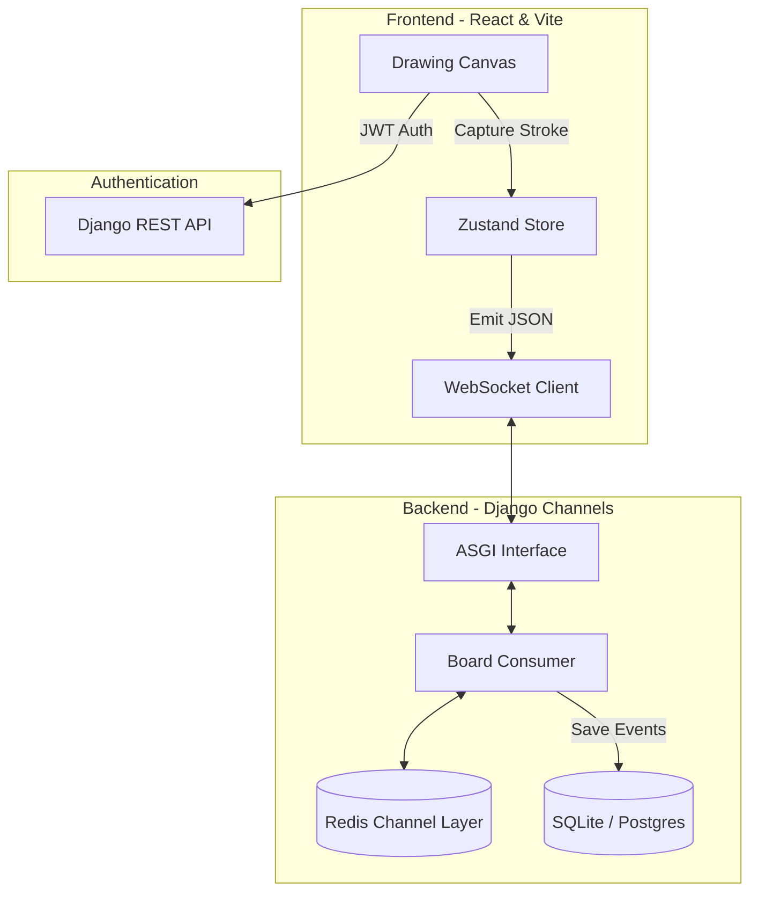

# Virtual Whiteboard

A professional-grade, real-time collaborative whiteboard platform designed for teachers, students, and creative teams. Building with **Django** and **React**, this application leverages WebSockets to provide a seamless, synchronized drawing experience.


## Technical Architecture & Flow

The application utilizes a high-concurrency, event-driven architecture to ensure sub-millisecond drawing synchronization.

### System Architecture



### Technical Workflow
1. **Protocol Propagation**: Drawing events are serialized into lightweight JSON packets containing coordinates, brush pressure, and color.
2. **Asynchronous Routing**: The `ASGI` server handles persistent connections, routing incoming WebSocket frames to the `BoardConsumer`.
3. **Broadcasting Engine**: `Django Channels` uses `Redis` as a backplane to group clients into "Room Groups". Logic in the consumer ensures that messages are broadcasted to all participants in the group with zero-latency.
4. **State Persistence**: To allow for session replays, the backend accumulates stroke data and periodically persists it to the relational database using Django signals/models.
5. **Security**: Every WebSocket handshake is verified against a `SimpleJWT` token, ensuring only authorized participants can join or modify valid rooms.

## Key Features
    
- **Real-time Collaboration**: Synchronized drawing strokes across all participants using Django Channels and WebSockets.
- **Role-Based Access**: Dedicated dashboards for Teachers (creation/management) and Students (collaboration).
- **Session Recording**: Capture and replay drawing sessions stroke-by-stroke.
- **Integrated Chat**: Seamless communication within every whiteboard room.
- **Room Persistence**: Unique slug-based rooms for easy sharing and secure access.
- **Premium Aesthetics**: Clean UI with Framer Motion animations and Tailwind CSS.

---

## Tech Stack

### Backend
- **Framework**: Django 4.2+
- **Real-time**: Django Channels & WebSockets
- **API**: Django REST Framework (DRF)
- **Auth**: SimpleJWT (JSON Web Tokens)
- **Storage**: Redis (Channel Layer), SQLite/PostgreSQL
- **Containerization**: Docker Support

### Frontend
- **Framework**: React 18 (Vite)
- **State Management**: Zustand
- **Animations**: Framer Motion
- **Drawing Engine**: React Canvas Draw
- **Styling**: Tailwind CSS
- **Routing**: React Router 7

---

## Getting Started

### Prerequisites
- Python 3.9+
- Node.js 18+
- Redis Server (Running on localhost:6379)

### 1. Backend Setup

```bash
cd backend
# Create and activate virtual environment
python -m venv venv
source venv/bin/activate  # On Windows: venv\Scripts\activate

# Install dependencies
pip install -r requirements.txt

# Run migrations
python manage.py migrate

# Create a superuser (for admin access)
python manage.py createsuperuser

# Start the dev server
python manage.py runserver
```

### 2. Frontend Setup

```bash
cd frontend
# Install dependencies
npm install

# Start the Vite development server
npm run dev
```

---

## Project Structure

```text
virtual-whiteboard/
├── backend/          # Django Backend
│   ├── boards/       # Whiteboard & Room logic
│   ├── core/         # User models & Auth
│   ├── project/      # ASGI/WSGI & Settings
│   └── manage.py
├── frontend/         # React Frontend
│   ├── src/
│   │   ├── components/ # Reusable UI components
│   │   ├── pages/      # Dashboards & Room views
│   │   └── utils/      # API & Socket helpers
│   └── package.json
└── README.md         # Main Documentation
```

## Usage

1. Open the **Frontend** URL (default: `http://localhost:5173`).
2. **Register/Login** to access your dashboard.
3. **Teachers** can create new rooms and share the link.
4. **Students** can join via the link or dashboard.
5. All drawing and chat actions are broadcasted in real-time to everyone in the room.

---

## License

This project is licensed under the MIT License.
